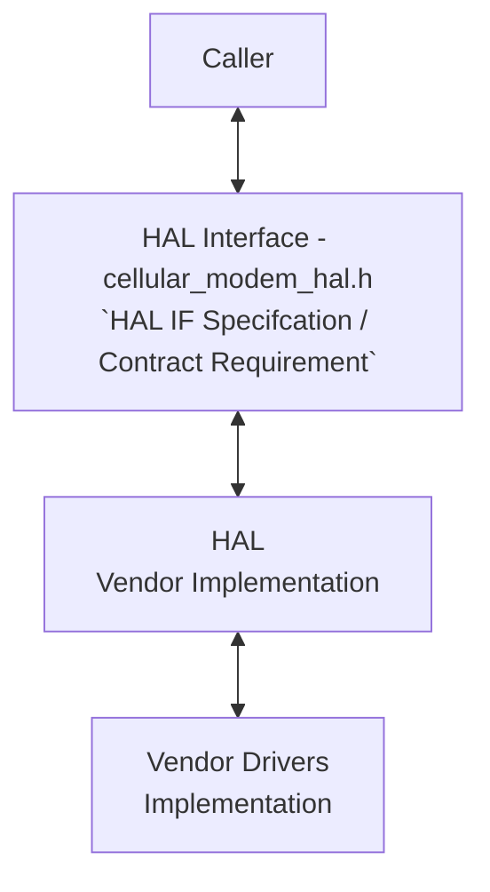
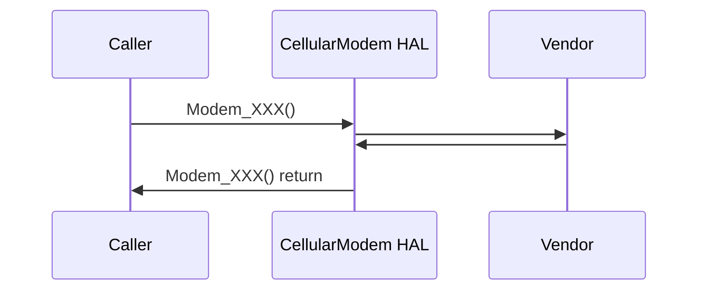

# CELLULAR MODEM HAL Documentation

## Acronyms

- `HAL` \- Hardware Abstraction Layer
- `HALIF` \- HAL Interface
- `RDK` \- Reference Design Kit
- `RDK-B` \- Reference Design Kit for Broadband Devices
- `SIM` \- Subscriber Identity Module
- `PIN` \- Personal Identification Number
- `PUK` \- Personal Unblocking Key
- `SMS` \- Short Message Service
- `USSD` \- Unstructured Supplementary Service Data
- `OEM` \- Original Equipment Manufacture

## Description

The CellularModem HAL (Hardware Abstraction Layer) is a versatile interface designed to streamline interactions with vendor-specific software for managing and accessing cellular modem hardware. It abstracts away the underlying implementation details of different modem models and vendors, providing a unified set of APIs for common operations like:

- **Retrieving hardware-specific information:** Firmware version, supported radio technologies, device identification (IMEI, ICCID, etc.)
- **Controlling modem operations:** Resetting, rebooting, enabling/disabling SIM power
- **Monitoring system status:** Checking for device presence, connectivity status, etc.
The CM HAL is intended to be a shared resource, accessible and usable by various Ccsp components and processes, promoting modularity and reusability within the system.

The diagram below describes a high-level software architecture of the Cellular Modem HAL module stack.

## Component Runtime Execution Requirements

### Initialization and Startup

The CellularModem HAL client module does not have explicit dependencies on other APIs for its core functionality. However, third-party vendors must implement this HAL to meet operational requirements.

**Important Note:** The interface is designed to block execution if the underlying cellular modem hardware is not ready for operation. This ensures proper initialization and resource availability before proceeding with cellular operations.

## Threading Model

The CellularModem HAL is not thread-safe. Any module or component invoking its APIs must ensure thread safety through external synchronization mechanisms.

**Vendor Implementation:**
Vendors have the flexibility to implement internal threading and event mechanisms within their software to meet operational needs. However, it is the vendor's responsibility to ensure these mechanisms:

**Synchronize access:** Properly synchronize access to the CellularModem HAL APIs to prevent race conditions and data corruption.
**Clean up resources:** Release any allocated resources (e.g., memory, threads, file handles) when the vendor software terminates or disconnects from the HAL.

## Process Model

All API's are expected to be called from multiple process.

## Memory Model

**Client Module Responsibility:** The client module using the CellularModem HAL is responsible for allocating and deallocating memory for any data structures required by the HAL's APIs. This includes structures passed as parameters to HAL functions and any buffers used to receive data from the HAL.

**Vendor Implementation Responsibility:** Third-party vendors, when implementing the HAL, may allocate memory internally for their specific operational needs. It is the vendor's sole responsibility to manage and deallocate this internally allocated memory.

TODO:
State a footprint requirement. Example: This should not exceed XXXX KB.

## Power Management Requirements

The CellularModem HAL is not involved in any of the power management operation.

## Asynchronous Notification Model

There are no asynchronous notifications.

## Blocking calls

**Synchronous and Responsive Operation:** The CellularModem HAL APIs operate synchronously, meaning each function call waits for completion before returning a result. Response times should align with the complexity of the requested operation and any performance specifications outlined in the API documentation.

**Timeout Handling:** For API calls that may be susceptible to external delays or unresponsiveness, implement appropriate timeout mechanisms. Specific timeout values or guidelines will be documented within the respective function descriptions or relevant specifications.

TODO:
As we state that they should complete within a time period, we need to state what that time target is, and pull it from the spec if required. Define the timeout requirement.

## Internal Error Handling

All CellularModem HAL APIs must return errors synchronously as a return value, ensuring immediate notification to the caller. The HAL is responsible for managing internal system errors (e.g., out-of-memory conditions) and reporting them through appropriate error codes.

## Persistence Model

There is no requirement for HAL to persist any setting information.

## Nonfunctional requirements

Following non functional requirement should be supported by the CellularModem HAL component.

## Logging and debugging requirements

The component is required to record all errors and critical informative messages to aid in identifying, debugging, and understanding the functional flow of the system. Logging should be implemented using the syslog method, as it provides robust logging capabilities suited for system-level software. The use of printf is discouraged unless syslog is not available.

All HAL components must adhere to a consistent logging process. When logging is necessary, it should be performed into the `cellular_modem_vendor_hal.log` file, which is located in either the `/var/tmp/` or `/rdklogs/logs/` directories.

Logs must be categorized according to the following log levels, as defined by the Linux standard logging system, listed here in descending order of severity:

- **FATAL:** Critical conditions, typically indicating system crashes or severe failures that require immediate attention.
- **ERROR:** Non-fatal error conditions that nonetheless significantly impede normal operation.
- **WARNING:** Potentially harmful situations that do not yet represent errors.
- **NOTICE:** Important but not error-level events.
- **INFO:** General informational messages that highlight system operations.
- **DEBUG:** Detailed information typically useful only when diagnosing problems.
- **TRACE:** Very fine-grained logging to trace the internal flow of the system.

Each log entry should include a timestamp, the log level, and a message describing the event or condition. This standard format will facilitate easier parsing and analysis of log files across different vendors and components.

## Memory and performance requirements

**Client Module Responsibility:** The client module using the HAL is responsible for allocating and deallocating memory for any data structures required by the HAL's APIs. This includes structures passed as parameters to HAL functions and any buffers used to receive data from the HAL.

**Vendor Implementation Responsibility:** Third-party vendors, when implementing the HAL, may allocate memory internally for their specific operational needs. It is the vendor's sole responsibility to manage and deallocate this internally allocated memory.

## Quality Control

To ensure the highest quality and reliability, it is strongly recommended that third-party quality assurance tools like `Coverity`, `Black Duck`, and `Valgrind` be employed to thoroughly analyze the implementation. The goal is to detect and resolve potential issues such as memory leaks, memory corruption, or other defects before deployment.

Furthermore, both the HAL wrapper and any third-party software interacting with it must prioritize robust memory management practices. This includes meticulous allocation, deallocation, and error handling to guarantee a stable and leak-free operation.

## Licensing

The implementation is expected to released under the Apache License 2.0.

## Build Requirements

The source code should be able to be built under Linux Yocto environment and should be delivered as a shared library named as `libhal_cellular_modem_hal_api.so`
  
## Variability Management

The role of adjusting the interface, guided by versioning, rests solely within architecture requirements. Thereafter, vendors are obliged to align their implementation with a designated version of the interface. As per Service Level Agreement (SLA) terms, they may transition to newer versions based on demand needs.

Each API interface will be versioned using Semantic Versioning 2.0.0, the vendor code will comply with a specific version of the interface.

## Platform or Product Customization

None

## Interface API Documentation

All HAL function prototypes and datatype definitions are available in `cellular_modem_hal_api.h` file.

1. Components/Process must include   `cellular_modem_hal_api.h` to make use of CellularModem hal capabilities.
2. Components/Process should add linker dependency for `libhal_cellular_modem_hal_api.so`.

## Theory of operation and key concepts

### Object Lifecycles

- **Creation/Initialization:**
  - The `cellular_modem_hal_init()` function initializes the HAL and returns a context handle (`cellular_modem_hal_ctx_t`). This handle is essential for all subsequent interactions.
  - Additional objects (e.g., SIM card handles, network interface handles) are not explicitly created or destroyed. They seem to be managed internally by the HAL and accessed indirectly through the context handle.
- **Usage:**
  - Most methods take the `cellular_modem_hal_ctx_t` as the first argument, operating on the specific modem instance represented by that context.
  - Some methods return additional handles (e.g., `sim_slot_t`, `network_interface_t`) for specific entities, but their lifecycle management is not fully documented.
- **Destruction:**
  - `cellular_modem_hal_deinit()` releases resources associated with the modem HAL instance. It is unclear if this automatically cleans up associated handles like SIM slots or network interfaces.

### Method Sequencing

- **Initialization is Mandatory:**
  - `cellular_modem_hal_init()` must be called before any other operations.
- **Logical Order:**
  - A logical order exists for some operations:
        a. Initialize the HAL.
        b. Get modem info (`cellular_modem_hal_get_modem_info()`).
        c. Potentially configure the modem or SIM (`cellular_modem_hal_set_modem_config()`,         `cellular_modem_hal_set_sim_state()`).
        d. Perform network operations (scanning, connecting, etc.).

### State-Dependent Behavior

- **Implicit State Model:**
  - The specification indirectly indicates a state model (e.g., modem powered on/off, network connected/disconnected).
  - Some methods (like retrieving signal information or performing network operations) are only valid in certain states.
- **State Transitions:**
  - The `cellular_modem_hal_power_up()` and `cellular_modem_hal_power_down()` functions explicitly manage the modem's power state.
  - Other state transitions (e.g., connecting/disconnecting from a network) are not explicitly controlled by the API, implying they might be triggered by external events or managed internally by the modem.

### Areas for Improvement (Documentation)

- **Explicit Object Lifecycle:** The documentation should clearly state how additional handles (e.g., for SIM cards, network interfaces) are obtained, managed, and released.
- **Detailed State Model:** A formal state diagram or description would clarify valid transitions and the allowed operations in each state.
- **Asynchronous Operations and Event Handling:** The API lacks clear mechanisms for handling asynchronous events (e.g., network registration changes, signal strength updates). This should be addressed in the documentation or potentially.

## Sequence Diagram

